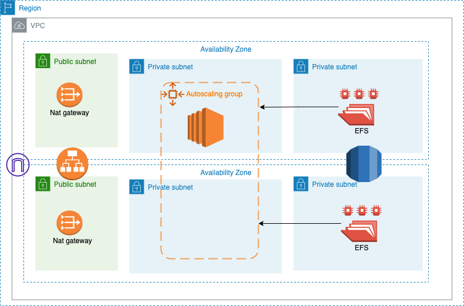

# infra
A complete infra for a demo project

Architecture Diagram:



Usage:
```
terraform plan --var-file=prod.tfvars
terraform apply --var-file=prod.tfvars
```

To ssh instance in private subnet
```
aws ssm start-session --target $instanceID
```
